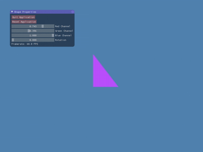
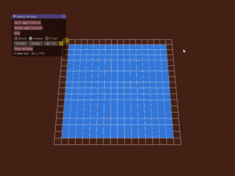
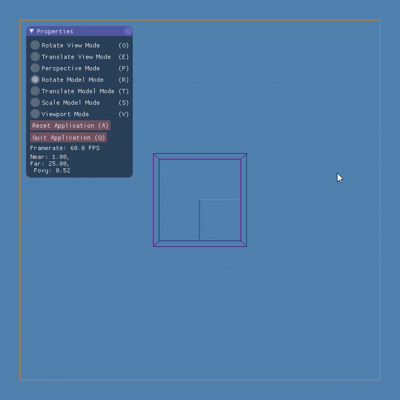
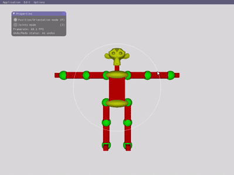
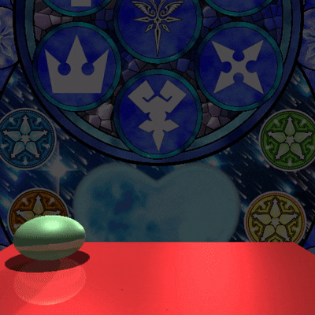

# Computer Graphics Programming Portfolio

[](#building--running)
[](#technical-stack)
[](#technical-stack)
[](#platform-notes)

A comprehensive collection of computer graphics applications demonstrating fundamental concepts from 2D transformations to advanced ray tracing. Built using modern OpenGL and C++, showcasing progressive complexity from basic 2D operations to sophisticated 3D rendering techniques.

## 🎯 Projects Overview

### A0: Interactive 2D Transformations



**Real-time 2D graphics manipulation system with intuitive GUI controls**

Features an interactive 2D graphics application that demonstrates fundamental transformation concepts through visual feedback. Users can manipulate geometric shapes using matrix operations while observing real-time changes through an ImGui-based interface.

**Core Technologies:**
- Matrix mathematics for 2D transformations (rotation, scaling, translation)
- ImGui integration for responsive user interface
- Real-time rendering with immediate visual feedback

**Skills Demonstrated:** Linear algebra, 2D graphics programming, GUI development, mathematical visualization

---

### A1: 3D Maze Navigation System



**First-person 3D maze exploration with advanced navigation mechanics**

A sophisticated 3D navigation system that implements first-person camera controls within a procedurally navigable maze environment. Features smooth camera movement, collision detection, and customizable visual elements.

**Core Technologies:**
- OpenGL 3D rendering pipeline with shader programs
- Real-time collision detection and response
- Interactive camera system with smooth movement
- Dynamic color customization interface

**Skills Demonstrated:** 3D graphics programming, spatial mathematics, collision systems, camera controls

---

### A2: Advanced 3D Camera System



**Comprehensive 3D viewing system with multiple projection modes**

Implements a sophisticated camera manipulation system that demonstrates advanced 3D viewing concepts. Users can interactively modify projection parameters, viewport settings, and camera positioning to understand the mathematics behind 3D rendering.

**Core Technologies:**
- Multiple projection modes (perspective and orthographic)
- Interactive FOV, near/far plane manipulation
- Real-time viewport transformation
- Advanced viewing matrix calculations

**Skills Demonstrated:** 3D mathematics, projection theory, camera systems, interactive visualization

---

### A3: Hierarchical Character Modeling



**Advanced character rigging and animation system with hierarchical control**

A complex 3D character manipulation system built around hierarchical scene graph principles. Features joint-based character rigging, multi-node selection, and comprehensive state management for professional-grade animation workflows.

**Core Technologies:**
- Hierarchical scene graph implementation
- Joint-based character rigging and posing
- Multi-selection manipulation system
- Undo/redo state management
- Lua scripting for flexible model loading

**Skills Demonstrated:** Scene graphs, hierarchical modeling, animation systems, data structures, scripting integration

---

### A4: High-Performance Ray Tracer



**Physically-based ray tracing renderer with advanced optimization**

A complete ray tracing implementation featuring physically accurate lighting calculations, anti-aliasing, and performance optimizations. Supports complex scene descriptions through Lua scripting and produces high-quality rendered images.

**Core Technologies:**
- Physically-based lighting and shading models
- Anti-aliasing and supersampling techniques
- Bounding volume hierarchy optimization
- Lua-scripted scene description language
- Multi-format output with PNG rendering

**Skills Demonstrated:** Ray tracing algorithms, optimization techniques, lighting models, computational geometry

## 💻 Technical Stack

### Core Technologies
- **Languages:** C++14, Lua 5.3
- **Graphics API:** OpenGL 3.2+ with modern shader pipeline
- **Mathematics:** GLM (OpenGL Mathematics) library
- **UI Framework:** Dear ImGui for immediate-mode interfaces
- **Build System:** CMake 3.10+ with cross-platform support
- **Platform:** Windows, Linux, macOS

### External Libraries
- **GLFW 3.3:** Cross-platform window and input management
- **gl3w:** OpenGL function loader
- **lodepng:** PNG image format support for ray tracer output
- **Lua 5.3.1:** Embedded scripting for scene description

## Architecture Highlights

- Modern OpenGL rendering pipeline with shader programs
- Object-oriented design with clean separation of concerns  
- Efficient memory management and resource handling
- Modular project structure for maintainability
- Cross-platform compatibility with consistent build system

---

## 🚀 Getting Started

### Prerequisites

- **Graphics Driver:** OpenGL 3.2+ compatible GPU driver
- **Compiler:** C++ compiler with C++14 support (GCC, Clang, or MSVC)
- **Build System:** CMake 3.10+ (modern build system)
- **Platform:** Windows, Linux, or macOS

### Quick Start

#### Using the Launcher (Recommended)

```bash
# Clone the repository
git clone https://github.com/yourusername/raytracer.git
cd raytracer

# Build all projects
mkdir build && cd build
cmake .. && cmake --build .

# Run the assignment launcher
# On Linux/macOS:
./launcher.sh

# On Windows:
launcher.bat
```

#### Manual Execution

```bash
# Build specific assignment
cmake --build build --target A4

# Run specific assignment
cd A4
../build/A4.exe Assets/simpleScene.lua
```

### 📋 Project Dependencies

| Library | Purpose | Version |
|---------|---------|----------|
| **GLFW** | Window management and input handling | 3.3+ |
| **GLM** | OpenGL mathematics library | Latest |
| **Lua** | Scripting engine for scene description | 5.3+ |
| **ImGui** | Immediate mode GUI framework | Latest |
| **OpenGL** | Graphics rendering API | 3.2+ |

### 🛠️ Build System

The project uses a modern CMake-based build system with organized script structure:

```
├── CMakeLists.txt          # Main build configuration
├── scripts/                # Assignment run scripts
│   ├── run_A0.sh/bat      # Individual assignment runners
│   ├── run_A1.sh/bat      
│   └── run_assignment.*   # Master assignment selector
├── launcher.sh/bat         # Root-level launchers
└── build/                  # Generated build files and executables
```

## 🎮 Usage Instructions

### Interactive Controls

Each assignment features specific interaction modes:

- **A0:** Mouse drag for transformations, GUI sliders for parameters
- **A1:** WASD for movement, mouse for camera look, GUI for colors
- **A2:** Mouse modes for different transformations (rotate/translate/scale)
- **A3:** Click and drag for joint manipulation, selection tools
- **A4:** Command-line ray tracer with Lua scene descriptions

### Scene Files

Assignments A3 and A4 use Lua scripting for scene configuration:

```lua
-- Example scene structure
scene = {
    camera = { position = {0, 0, 10}, target = {0, 0, 0} },
    lights = { ... },
    objects = { ... }
}
```

## 🏗️ Architecture Overview

### Design Principles

- **Modular Architecture:** Each assignment is self-contained with shared framework
- **Modern OpenGL:** Shader-based rendering pipeline with version 3.2+ features
- **Cross-Platform:** Consistent behavior across Windows, Linux, and macOS
- **Performance-Oriented:** Efficient memory management and optimized algorithms

### Code Structure

```
A*/                         # Individual assignment folders
├── *.cpp, *.hpp          # Assignment-specific source code
├── Assets/               # Resources (models, textures, scenes)
└── shaders/              # GLSL shader programs

shared/                    # Common framework and libraries
├── cs488-framework/      # Course-specific utilities
├── glfw-3.3/            # Window management
├── imgui/               # GUI framework
└── lua-5.3.1/           # Scripting engine
```

## 📊 Performance Characteristics

| Assignment | Complexity | Frame Rate | Memory Usage |
|------------|------------|------------|---------------|
| A0 | O(n) transforms | 60+ FPS | ~50MB |
| A1 | O(n) collision | 60+ FPS | ~75MB |
| A2 | O(1) camera ops | 60+ FPS | ~60MB |
| A3 | O(n) hierarchy | 30+ FPS | ~100MB |
| A4 | O(n²) ray trace | N/A (offline) | ~200MB |

## 🔧 Platform Support

### Windows
- **Compiler:** Visual Studio 2019+, MinGW-w64
- **Graphics:** DirectX-compatible OpenGL drivers
- **Build:** CMake with MinGW Makefiles or Visual Studio generator

### Linux
- **Compiler:** GCC 7+, Clang 6+
- **Graphics:** Mesa or proprietary GPU drivers
- **Build:** Standard CMake with Unix Makefiles

### macOS
- **Compiler:** Xcode 10+, Command Line Tools
- **Graphics:** Metal-compatible OpenGL drivers
- **Build:** CMake with Unix Makefiles or Xcode generator

---

## 📝 License

This project is developed for educational purposes as part of a computer graphics course curriculum.

## 🤝 Contributing

This is an academic project showcasing computer graphics programming concepts. While not open for external contributions, the code serves as a reference for graphics programming techniques and educational purposes.
