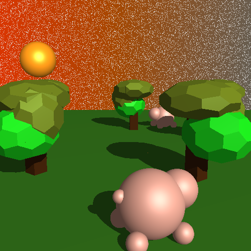

# Raytracer

A multithreaded CPU ray tracer in C++, with scenes described in Lua.



No OpenGL, no windowing, no GUI — it reads a Lua scene, traces it across
every core, and writes a PNG.

## Features

- **Whitted recursive ray tracing** — reflections to a configurable depth
- **Blinn-Phong shading** — ambient, diffuse and specular via the half-vector
- **Hard shadows** — one shadow ray per point light
- **Primitives** — spheres, boxes, and arbitrary triangle meshes from OBJ files
- **Hierarchical scene graph** — rays are transformed into each node's local
  space; normals are carried back by the inverse-transpose
- **Multithreaded** — the image is split across threads by scanline band
- **Anti-aliasing** — supersampling, `gr.set_aa(n)`
- **Keyframe animation** — a Lua loop drives per-frame transforms from a CSV
  and renders a numbered PNG sequence
- **Lua scene description** — geometry, materials, lights and camera

In progress: depth of field via a thin-lens camera, and a BVH. See
[ROADMAP.md](ROADMAP.md).

## Building

Needs a C++14 compiler and CMake 3.16+. Every dependency is vendored under
`third_party/` (glm, lodepng, Lua), so there is nothing to install.

```bash
cmake -S . -B build -DCMAKE_BUILD_TYPE=Release
cmake --build build -j
```

On Windows with MSYS2/MinGW:

```bash
export PATH="/c/msys64/mingw64/bin:$PATH"
cmake -S . -B build -G "MinGW Makefiles" -DCMAKE_BUILD_TYPE=Release
cmake --build build -j
```

## Running

Scenes resolve asset paths relative to the working directory, so run from the
repo root:

```bash
./build/raytracer Assets/simple.lua        # five spheres
./build/raytracer Assets/macho-cows.lua    # ~35k triangles
./build/raytracer                          # defaults to Assets/simple.lua
```

The output filename, resolution and camera all come from the scene's
`gr.render` call.

### Animation

`prAssets/final_animation.lua` reads keyframes from a CSV, rebuilds the scene
for each frame, and renders a numbered PNG sequence into `Renders/`:

```bash
./build/raytracer prAssets/final_animation.lua
scripts/stitch_animation.sh Renders/bkeytest_frame_ 24 animation.mp4
```

The stitching script needs `ffmpeg` on your PATH.

## Scene format

Scenes are plain Lua, so anything Lua can do — loops, maths, reading a CSV —
is available when building a scene.

```lua
mat = gr.material({0.7, 1.0, 0.7}, {0.5, 0.7, 0.5}, 25)  -- diffuse, specular, shininess

scene = gr.node('root')

s1 = gr.nh_sphere('s1', {0, 0, -400}, 100)               -- centre, radius
s1:set_material(mat)
scene:add_child(s1)

cow = gr.mesh('cow', 'Assets/cow.obj')
cow:set_material(mat)
cow:scale(10, 10, 10)
cow:translate(0, -50, -300)
scene:add_child(cow)

light = gr.light({-100, 150, 400}, {0.9, 0.9, 0.9}, {1, 0, 0})

gr.set_aa(4)                                             -- optional supersampling
gr.render(scene, 'out.png', 512, 512,
          {0, 0, 800}, {0, 0, -800}, {0, 1, 0}, 50,      -- eye, view, up, fov
          {0.3, 0.3, 0.3}, {light})                      -- ambient, lights
```

## Architecture

| | |
|---|---|
| `Main.cpp`, `scene_lua.cpp` | Lua bindings and entry point |
| `A4.cpp` | the render loop, ray generation, shading, threading |
| `SceneNode`, `GeometryNode`, `JointNode` | scene graph and ray transport |
| `Primitive`, `Mesh` | intersection tests |
| `BVH`, `AABB` | acceleration structure (in progress) |
| `Camera`, `Sampling` | thin-lens camera and samplers (in progress) |
| `PhongMaterial`, `Light` | shading inputs |
| `Image` | framebuffer and PNG output |
| `polyroots.cpp` | quadratic/cubic/quartic root finding |

## Performance

Measured on a 20-core machine, Release build, wall clock including process
start and decoding the 3.3 MB background texture.

| Scene | Resolution | Time |
|---|---|---|
| `Assets/simple.lua` (5 spheres) | 256×256 | ~120 ms |
| `Assets/macho-cows.lua` (~35k triangles) | 256×256 | ~4.0 s |
| one animation frame | 512×512 | ~230 ms |

The mesh scene is about 33× slower than the sphere scene at the same
resolution, because every ray currently tests every triangle. That is what the
BVH is for.

One finding worth recording: the renderer used to spend **432 µs per pixel** on
a five-sphere scene. Profiling showed only 12.5 intersection tests per pixel,
so the cost was never in the intersection maths — `rayTraceRGB` took the
background image *by value*, and it decodes to 3.3 MB, so every ray copied it.
Passing by reference took `simple.lua` at 256×256 from **28,316 ms to 76 ms**
with byte-identical output, and explained why 16 threads had only been buying
2× on 20 cores: the renderer was memory-bandwidth-bound, not compute-bound.

## Provenance and licensing

This began as assignment 4 of the University of Waterloo's CS488 computer
graphics course and has been extended well beyond it. Some scaffolding
(`polyroots.cpp`, the Lua binding layer, `Image`) comes from the
course-provided skeleton.

Vendored third-party code keeps its own licence: glm (MIT), lodepng (zlib),
Lua (MIT). No top-level licence has been chosen for the original work yet.
