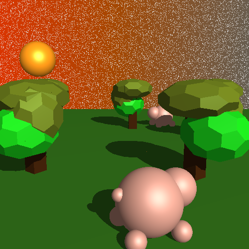

# Raytracer

A multithreaded CPU path tracer in C++, with scenes described in Lua.



## Features

- Path tracing with Russian roulette, and energy-conserving BSDFs (Lambertian,
  Blinn-Phong, mirror, metal, dielectric) verified by furnace tests
- Image-based lighting, point-light shadow rays, thin-lens depth of field
- Spheres, boxes and OBJ meshes in a scene graph; a per-mesh BVH (median or SAH)
- Linear-colour accumulation, tone-mapped once at write-out. Next: textures

## Build and run

C++17 and CMake 3.16+. Every dependency is vendored under `third_party/`.
On Windows with MSYS2, add `-G "MinGW Makefiles"` to the first command.

```bash
cmake -S . -B build -DCMAKE_BUILD_TYPE=Release && cmake --build build -j
./build/raytracer assets/scenes/macho-cows.lua    # run from the repo root
ctest --test-dir build -j 8 --output-on-failure   # tests, in parallel
```

Output file, resolution and camera come from the scene's `gr.render` call.
To write a scene, copy [`assets/scenes/template.lua`](assets/scenes/template.lua).

| Environment variable | Effect |
|---|---|
| `RT_LOG=debug`, `RT_LOG=off,geom:debug` | Log verbosity, overall or per category |
| `BVH_TRAVERSAL=linear\|recursive\|iterative` | Which intersection path meshes use (default `iterative`) |
| `BVH_SPLIT=median\|sah` | How the BVH is split when a mesh loads (default `median`) |
| `BVH_VERIFY=1` | Check the BVH against the linear scan on every ray |
| `RT_STATS=1` | Count nodes visited and triangles tested (off by default: counting slows the render ~17-20%) |
| `RT_THREADS=n`, `RT_SPP=n` | Thread count (default: all hardware threads) and samples per pixel (default: the scene's). The image depends on both |
| `RT_VIEW=normal\|albedo\|uv` | Write the primary hit's normal, unshaded surface colour, or (u, v) as red and green, instead of shading, with no tone map and no sRGB |

## Docs

- [WALKTHROUGH](docs/WALKTHROUGH.md): one ray, from `main()` to a byte in a PNG
- [ROADMAP](docs/ROADMAP.md): status, the plan, and the measurements
- [ENGINEERING](docs/ENGINEERING.md): deadline, scope and blog writeups
- [REFERENCE](docs/REFERENCE.md): logging, scene format, tests, style, performance

## Provenance and licensing

Began as assignment 4 of Waterloo's CS488; some scaffolding (`polyroots.cc`, the
Lua bindings, `Image`) is course-provided. Vendored code keeps its licence: glm
(MIT), lodepng (zlib), Lua (MIT). No licence is chosen yet for the original work.
