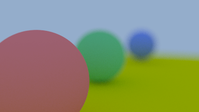
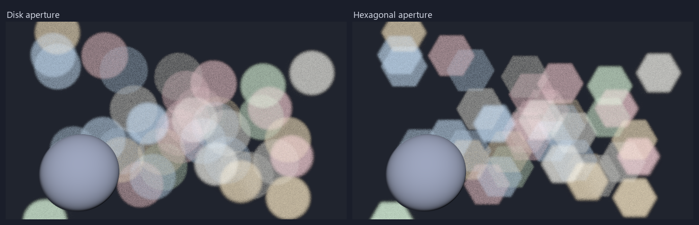
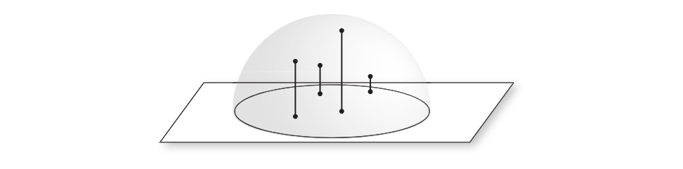
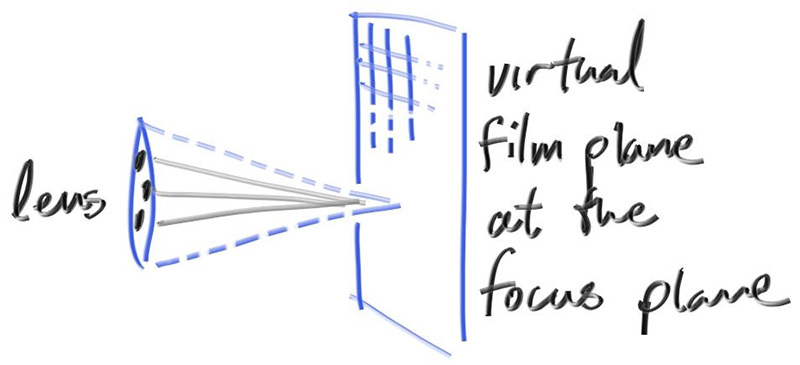
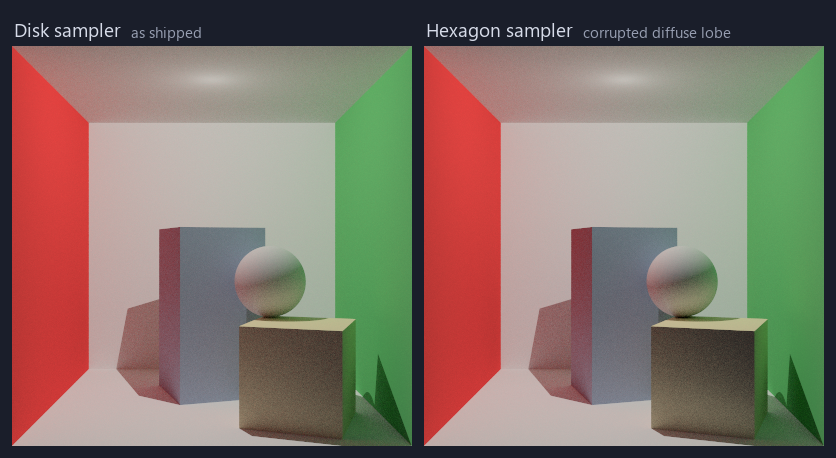
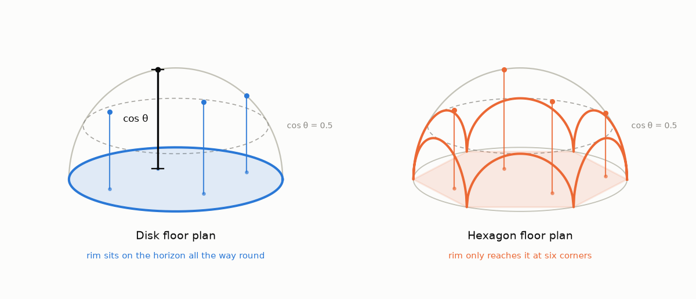
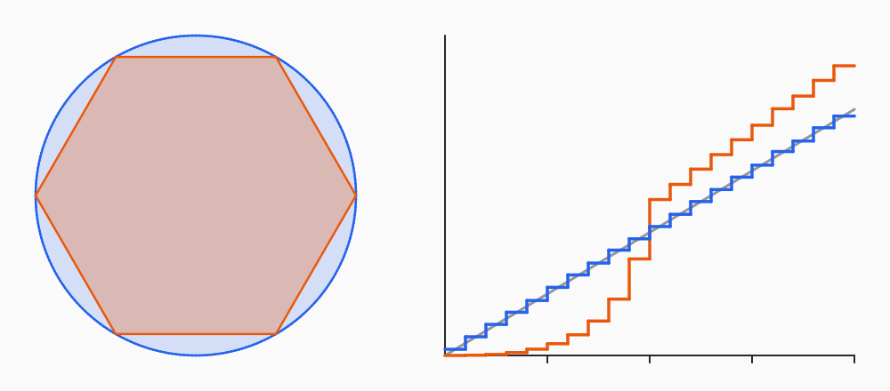
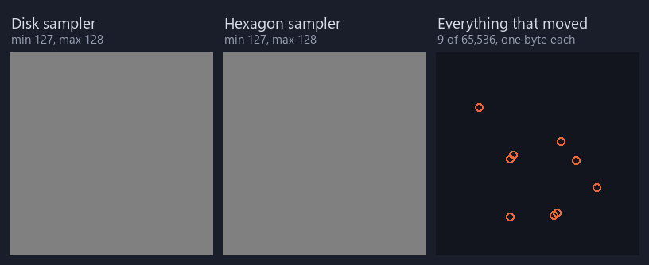
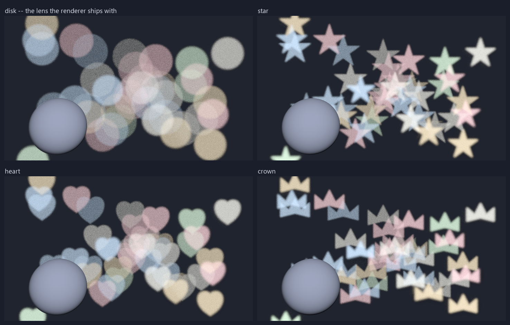

<!-- COVER: hexagonal bokeh
     render this aperture belongs to. Upload it and paste the URL into
     cover_image: above. dev.to crops covers to 1000x420. -->

I have experimented with a lot of features on my raytracing journey. I played with reflections, implemented shadows, and lost braincells getting scenes to render. Finally, I implemented defocus blur.



<!-- IMAGE: the link above is a repo path, for local preview only. Regenerate
     with ./build/raytracer assets/scenes/thin_lens.lua, then copy
     renders/thin_lens_near.png. Swap the path for an uploaded URL before
     publishing. -->

---

The image reminded me of the bokeh you see in photos. Sometimes they aren't always round.


_Not a render. A heart cut out of card, taped over a camera lens_

<!-- IMAGE: reference photo, not mine. Credit the source before publishing, and
     swap the repo path for an uploaded URL. -->

So I tried it with what I already had: two passes of the same scene, one circular and one hexagonal.

<!-- Basic image render with circular bokeh -->



_Same scene, Different sampler_

<!-- IMAGE: docs/images/bokeh-comparison.png (exists). Regenerate with
     ./build/raytracer assets/scenes/bokeh.lua, which now writes one frame per
     aperture; copy the disk and hexagon frames into docs/images/ and run
     python scripts/make_bokeh_figure.py to stack them. Swap the repo path for
     an uploaded URL before publishing. -->

At that point I felt like I could turn anything into bokeh. I could have hearts, stars, concentric circles. Why not push it further?

Then I noticed something. Every diffuse surface in my renderer would suffer.

---

Here is the primitive that both my lens sampler and diffuse surface lean on. It rejection-samples a square until a point lands inside the unit disk, and that test is the only reason the shape
comes out round.

```cpp

inline glm::vec2 SampleUnitDisk(Rng& rng) {
  while(true){
    float x = rng.Range(-1.0f, 1.0f);
    float y = rng.Range(-1.0f, 1.0f);
    if (x * x + y * y <= 1.0f) return glm::vec2(x, y);
  }
}

```

And here is what the hexagonal change looked like:

```cpp
// Regular hexagon inscribed in the unit circle: corners at radius 1, flat top
// and bottom, flat edges at the apothem sqrt(3)/2 ~= 0.866.
constexpr float kApothem = 0.8660254f;

inline glm::vec2 SampleUnitDisk(Rng& rng) {
  while (true) {
    float x = rng.Range(-1.0f, 1.0f);
    float y = rng.Range(-1.0f, 1.0f);
    // WAS: if (x * x + y * y <= 1.0f) return glm::vec2(x, y);
    if (std::fabs(y) <= kApothem &&
        std::fabs(kApothem * x + 0.5f * y) <= kApothem &&
        std::fabs(kApothem * x - 0.5f * y) <= kApothem) {
      return glm::vec2(x, y);
    }
  }
}

```

The two separate call sites:

```cpp
// The camera: a physical aperture.
const glm::vec2 lens_uv = SampleUnitDisk(rng) * cfg.aperture_radius;

// The diffuse BSDF wrapper
inline glm::vec3 CosineWeightedHemiSphereSurface(Rng& rng,
                                                 const glm::vec3& normal,
                                                 const glm::vec3& tangent,
                                                 const glm::vec3& binormal) {
  const glm::vec2 d = SampleUnitDisk(rng);
  const float z = std::sqrt(std::max(0.0f, 1.0f - d.x * d.x - d.y * d.y));
  return d.x * tangent + d.y * binormal + z * normal;
}
```

---

## Why do my BSDF and my lens share a disk sampler?

Fair question. If testing, or more fittingly, playing with my lens can break my diffuse surfaces, why the coupling?

The BSDF side is **Malley's method**. Sample a point inside a unit disk, then project it along the normal onto a hemisphere originating from the ray's intersection with the surface. That is how you implement a diffuse surface.



_The lift, drawn. Every point on the disk rises straight up to the dome above
it. Figure A.10 from [Physically Based Rendering: From Theory to
Implementation](https://www.pbr-book.org/4ed/Sampling_Algorithms/Sampling_Multidimensional_Functions),
4th ed., by Matt Pharr, Wenzel Jakob and Greg Humphreys._

<!-- IMAGE: reference figure, not mine -- copied from pbr-book.org, credited in
     the caption above. Confirm reuse is acceptable before publishing. Drawing
     a replacement is not free: malley_figure.cc rasterises flat 2D panels and
     has no perspective projection, so this view would be new code.
     Swap the repo path for an uploaded URL. -->

The lens side never heard of Malley. Randomizing around the origin allows the ray to focus on a particular plane.
Near and far images blur out, while whatever sits on that plane stays in focus. Guess how we randomize around the origin.
Exactly!!
We sample within a unit disk.



_"Camera focus
plane", Figure 1.22 of
[Ray Tracing in One
Weekend](https://raytracing.github.io/books/RayTracingInOneWeekend.html#defocusblur)
by Peter Shirley, Trevor David Black and Steve Hollasch, released under CC0._

<!-- IMAGE: docs/images/reference/rtiow-fig-1.22-cam-film-plane.jpg, the
     original from the RayTracing/raytracing.github.io repo (CC0-1.0, so reuse
     is unrestricted; the credit above is courtesy, not obligation). Swap the
     repo path for an uploaded URL before publishing. -->

<!-- include near and far focus, and not sampling images to compare -->

So both sides have to sample a unit disk, and voila; one function, two
callers. Apparently PBRT does it the same way, so I will take that as great
minds thinking alike.

## I only caught it by reading the code

So how did I catch it? I read the code, because I wrote it. Nonetheless, I cannot rely on that catch. I
could easily have missed it, someone opening the file a year from now could miss it too, and neither of us would know the diffuse was off until much later.

Looking at the render does not help either. I can make the hexagon, sure, but the diffuse barely moves.



_Every surface in that box is Lambertian, so there is nothing else to look at._

Do you notice the difference? Do you see the shadows shift? Yeah, neither do I. Without the two frames side by side I would have walked straight past this.

<!-- IMAGE: docs/images/diffuse-comparison.png. Both halves come from
     assets/scenes/diffuse_sampler.lua at 256 spp -- once as shipped, once with
     the hexagon rejection test in SampleUnitDisk -- then
     python scripts/make_diffuse_figure.py to stack them and print the numbers
     above. The noise floor is a third render, renders/diffuse_disk_seed2.png:
     the shipped sampler with the seed constant in renderer.cc perturbed, which
     is noise of the same size with no bias. Swap the repo path for an uploaded
     URL before publishing. -->

So I said to myself, "What can I actually check for?"

Check that it is still a circle? I can only answer that by
looking at what the sampler _draws_ rather than the lines that produce it.

## Any sampler is correct as long as the `Pdf()` tells the truth

So start with the shape mine draws, and why it works at all. It works because solid angle projects onto the disk with a factor
of cosine, $dA = \cos\theta \, d\omega$, so a uniform disk sample lifted to the
hemisphere has density

$$
p(\omega) = \frac{\cos\theta}{\pi}
$$

For a Lambertian surface, whose BRDF is $\rho/\pi$, the estimator then cancels
completely:

$$
\frac{f_r \cos\theta}{p(\omega)} = \frac{(\rho/\pi)\cos\theta}{\cos\theta/\pi} = \rho
$$

Each bounce multiplies output by exactly the _albedo_, `ρ` (the fraction of
light a surface sends back, [0,1]).

Read that derivation again, though, and notice what it never asks for. It never
asks for a disk.

Which means I can build the same lobe without one. Here is the road _Ray Tracing
in One Weekend_ takes: stand at the tip of the normal, push out by a random unit
vector, and normalise where you land.

```cpp
const glm::vec3 dir = glm::normalize(normal + RandomUnitVector(rng));
```

That one draws from a ball. It never touches a disk, and it arrives at the same
cosine lobe anyway. Two roads, one distribution and I can compare without knowing in advance where the distribution is supposed to be. Get it memorized.

### The lift, and what the hexagon does to it

Malley's method is one picture. Put the shape underneath the hemisphere like a
floor plan, and let every point on it rise straight up to the dome. The height it lands at is cos θ.
The cloud of directions you end up with is the **lobe** the fat dome.



_Same dome, same straight-up lift, same horizon, and in both the rise is cos θ.
The only thing that differs is the rim. The disk's sits on the horizon the whole
way round; the hexagon's plunges there at six corners and stops dead at cos θ =
0.5 in between._

<!-- IMAGE: docs/images/malley-lift.png. Regenerate with
     python scripts/malley_lift_figure.py (needs matplotlib). Swap the repo
     path for an uploaded URL before publishing. -->

Look at the hexagon in that diagram and notice how little moved. Every point
still lands above the horizon, the centre still maps to the normal, and it is
still a fat lobe crowding around it.

What moves is the rim, and only the rim. A hexagon's corners reach r = 1, but its edges cut in to the _apothem_ (as close as an edge ever gets to the centre) = √3/2 ≈ 0.866, and √3/2 lifts to cos θ = 0.5. Its SOH CAH TOA again. So the
grazing directions survive in six chunks and are gone the rest of the way round.

Which is enough to price the damage before anything runs, because the lift hands
every question about the lobe back to the floor plan. Malley over a region $R$
of area $A$ gives density $\cos\theta / A$, so every moment is an integral over
the shape:

$$
\mathbb{E}[\cos^{k}\theta] = \frac{1}{A}\int_{R} \left(1 - r^{2}\right)^{k/2} dA
$$

Read $\mathbb{E}[\,\cdot\,]$ as "_the average of_". At $k = 2$ we lose the
square root entirely:

$$
\mathbb{E}[\cos^{2}\theta] = 1 - \mathbb{E}[r^{2}]
$$

so the second moment is the floor plan's mean squared radius. At $k = 1$, one
polar integral per edge, and for a hexagon it closes:

| Floor plan       | Area               | `E[cos]`                    | `E[cos²]`     |
| ---------------- | ------------------ | --------------------------- | ------------- |
| disk _(correct)_ | π ≈ 3.142          | 2/3 ≈ 0.6667                | 1/2 = 0.5     |
| hexagon          | 3√3/2 ≈ 2.598      | 3π/4 − 8√3π/27 ≈ **0.7439** | 7/12 ≈ 0.5833 |
| hexagon, off by  | −17.3% of the area | +0.077                      | +1/12 ≈ 0.083 |

Nothing is specific to hexagons. Hand it a square, a heart, a
five-pointed star, and the same two integrals price that sampler too. And the
other road has no floor plan at all, which is the point of it: built out of
`SampleUnitBall`, it sits on the disk's row, 2/3 and 1/2, exactly, whatever
shape the lens becomes.

So we currently have a few predictions in before a single test run: 0.744 against 0.667 with a gap of 0.077.

Get that memorized, also.

## So I built the bug on purpose

I reverted to a hexagon in `SampleUnitDisk` and ran my tests.



_The disk (blue) lands on the exact cosine lobe (grey); the hexagon (orange)
does not. Its step at cos θ = 0.5 is the apothem, lifted, and the two markers on
the axis are the means: 2/3 and 0.744._

<!-- IMAGE: docs/images/malley-hexagon.png (exists). Regenerate with
     python scripts/malley_figure.py. The numbers quoted in the post come from
     scripts/malley_figure.cc instead, whose build command is at the top of
     that file. Swap the repo path for an uploaded URL before publishing. -->

| Check                    | Compares              | Real sampler | Hexagon            |
| ------------------------ | --------------------- | ------------ | ------------------ |
| Furnace, 10 render tests | pixels vs environment | pass         | **pass**           |
| Mean cosine              | vs 2/3                | 0.6663       | **0.7437 -- fail** |
| `cos²/pdf` integral      | vs 2π/3 ≈ 2.0944      | 2.0943       | **2.3373 -- fail** |

**The furnace passed**, as expected. All 10 render tests stayed green. The
furnace check essentially checks the radiance, and that was virtually no
different.



_Correct looks like this. So does broken. The third panel is every pixel that
moved between them -> 9 of 65,536, one byte each._

The two below it check shape( the second is π times the first, for a Lambertian) and both failed. In line with our prior prediction. Remember the 0.744 number. Yeah, we are in business now.

## The test that caught it

Let's dive deeper into that test. Before making the change I had already written a test that builds the cosine lobe that way, and it draws from
`SampleUnitBall`, not `SampleUnitDisk`, so it cannot move when the aperture
does. Two constructions of one distribution have to agree on every moment,
which makes them a **differential test**: no reference renderer, no known
answer needed. Over 2 million samples each:

|                                     | `E[cos]`    | `E[cos²]`   |
| ----------------------------------- | ----------- | ----------- |
| Malley (disk lift)                  | 0.66634     | 0.49964     |
| `normalize(n + RandomUnitVector())` | 0.66662     | 0.49999     |
| hexagon lift                        | **0.74374** | **0.58309** |
| exact, cosine lobe                  | 0.66667     | 0.50000     |
| exact, hexagon lobe                 | 0.74393     | 0.58333     |

We can see from the table above that we were right within 4 significant figures, in other words we were still right.
The earlier predictions for both `E[cos]` and `E[cos²]` matchup.

## What I do differently now

- **Share on mechanism, never on coincidence.** I will still share primitives. The ideal move is creating new primitives for specific cases. I already know too. Utilizing a proper separation of concerns.
- **Test the shape, not just the total.** The furnace passed, and it measure totals. I still needed to test the shape.
- **Build the bug on purpose.** You just might learn something.

## The shapes I wanted in the first place

The lesson was never "don't shape the aperture." It was "give the lens its own
sampler first." So that is what I did, and then I spent an evening on the part
that has no excuse.



_Same field, same seeds, four openings. Only the rejection test moved._

<!-- IMAGE: docs/images/bokeh-shapes.png (exists). Regenerate with
     ./build/raytracer assets/scenes/bokeh.lua, copy the four frames it writes
     into docs/images/, then python scripts/make_bokeh_shapes_figure.py. Swap
     the repo path for an uploaded URL before publishing. -->

Look at all those images. "chef kiss." This was really all I wanted and it could have broken such a key section of my ray tacer. Sometimes that is the price of having one.

---

_From a path tracer I'm building in C++. Next: getting total internal reflection
wrong in four different ways before getting it right._
